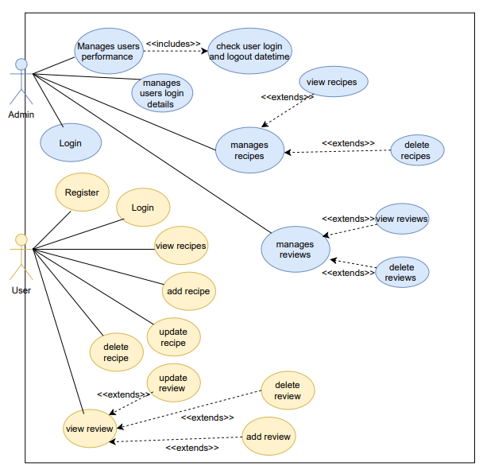
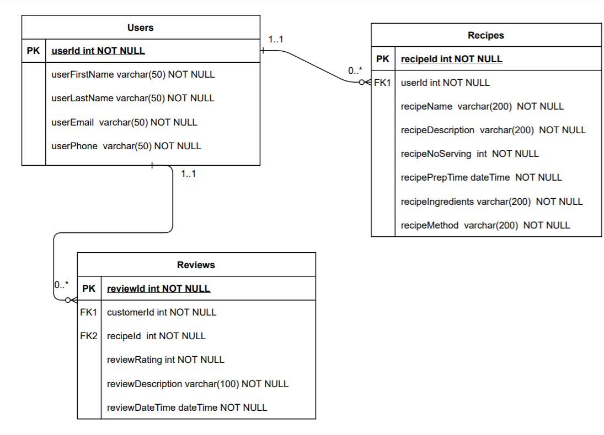

# Cook Book App
### Abstract
The cook book will include different type of recipes. The users will be able to interact with the cook book app through CRUD functionalities such as add, read, update and delete recipes on the cook book app. The app is mainly designed to allow different types of users to view various types of recipes, allowing them to use the recipes available on cook book to enhance their both cooking and learning techniques. This app can be used by anyone whether they just want to view recipes for their cooking or to help others by adding in recipes to the app. The cook book app may also allow the users to leave a review for a recipe. This project will follow an agile methodology, followed by diagrams, risk assessement carried out and requirements that will be gathered to execute the interactive cook book app. Lastly, unit testing and continous integration will also be performed which will confirm if the app is ready to deploy for the users. 
### Aim and Objectives
The aims and objectives of this projects are as the following:
<table>
  <body>
    <tr>
      <th>Aims </th>
      <th align="center">Objectives</th> 
    </tr>
    <tr>
      <td><ul><li>Use an agile methodology to manage the project</li></ul></td>
      <td align="left"><ul>
          <li>Will use an agile methodology called Trello board to set deadlines for tasks and carry out tasks</li>
          <li>On the Trello board, will create user stories, use cases and tasks which are needed to complete the project</li>
        </ul></td>
    </tr>
    <tr>
      <td><ul><li>Create a design which describe the architecture of the Cook Book App</li></ul></td>
      <td align="left"><ul><li>Will create a list of requirements using the MoSCoW technique</li>
        <li>Will draw diagrams such as the ERD, use case diagrams and wireframes</li>
        <li>Will carry out risk assessement to demonstrate the potential risks within this project</li>
        </ul></td>
    </tr>
    <tr>
      <td><ul><li>Create a working CRUD functionality created for the Cook Book App using a database and coding</li></ul></td>
      <td align="left">
      <ul><li>Will be using programming languages such as C# to create the backend of the CRUD functionality</li>
      <li>Will be using MySQL database to store the data for the recipes and reviews and connect it to C#</li></ul>
      </td>
    </tr>
    <tr>
      <td>
        <ul>
          <li>create a working front end functionality Cook Book App</li>
        </ul>
      </td>
      <td align="left"><ul>
          <li>Will be using ASP.NET to create the front end, allowing the users to interact with the Cook Book App</li>
        </ul></td>
    </tr>
    <tr>
      <td>
        <ul>
          <li>Testing for the Cook Book App</li>
        </ul>
      </td>
      <td align="left"><ul>
          <li>Carry out unit testing and automated testing to validate the application</li>
           <li>Provide consistent reports and evidence using a TDD approach</li>
        </ul></td>
    </tr>
     <tr>
      <td>
        <ul>
          <li>Integrate the code for the Cook Book App</li>
        </ul>
      </td>
      <td align="left"><ul>
          <li>Contionous integration of the code into a VCS (Version Control System) using the Feature-Branch model</li>
           <li>Deploy the Cook Book App to the cloud-base dbirtual machine through a CI server</li>
        </ul></td>
    </tr>
  </body>
</table>
  
### Functional and Non-functional Requirements 
The table below shows the requirements of the project using the MoSCoW technique where I will be prioritising requirements.
<table>
  <body>
    <tr>
      <th align="centre">Must Have </th>
      <th align="centre">Should Have</th> 
      <th align="centre">Could Have</th> 
      <th align="centre">Wont Have</th> 
    </tr>
    <tr>
      <td align= "left">The user must be able to read the recipes on the Cook Book App</td>
       <td align= "left">The user can view reviews</td>
      <td align= "left">The user can register</td>
      <td align= "left">The admin can login</td>
    </tr>
    <tr>
      <td align="left">The user must be able to add the recipes to the Cook Book App</td>
       <td align= "left">The user can add reviews</td>
  <td align= "left">The user can login</td>
  <td align= "left">The admin can manage users E.g. delete, update users</td>
    </tr>
    <tr>
      <td align="left">The user must be able to update the recipes to the Cook Book App</td>
      <td align= "left">The user can update a review</td>
      <td align= "left">The user can validate their username and password</td>
       <td align= "left">The admin can track the users performance E.g datetime user logged in and out</td>
    </tr>
    <tr>
      <td align="left">The user must be able to delete the recipes to the Cook Book App</td>
      <td align="left">The user can delete a review</td>
      <td align="left"></td>
       <td align= "left">The admin can manage reviews.E.g delete reviews</td>
    </tr>
</table>

### Use Case diagram 
Below is the the use case diagram which demonstrates how the user will be interacting with the system which in this case is the Cook Book App (Please note that for implementation, I will only be interacting with two database tables which are recipes and reviews).

### Entity diagram 
Below is the Chen's conceptual model for the CookBook App. The diagram consists of entity types which in this case are Recipes, Users and Reviews, it also consists of relationships which are manages and contains. The user will manage recipes which in further detail means that the user can add/delete/update/review recipes. For the following entity types, there are different types of attributes such as primary key, foreign key and other attributes. The attributes in yellow are the primary key and the attributes in pink are the foreign key, which essentially means that this attribute was inherited from another table. 

